## 破解 EaseUS Data Recovery Wizard MACOS 13.9.1

### 确定程序目标

首先我们要确定我们的目标，我们这次的目的是去除软件的试用限制，并不用去拆解某个功能

### 观察程序功能

确定了目标后就要观察程序的功能

打开程序

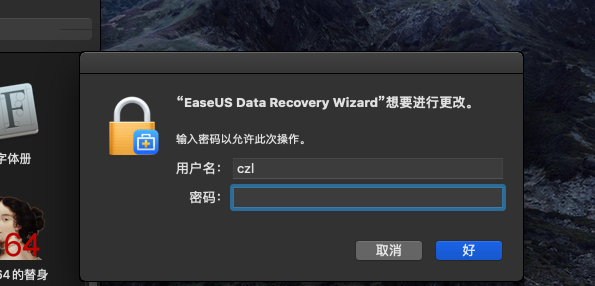

这个程序在一开始会申请管理员权限

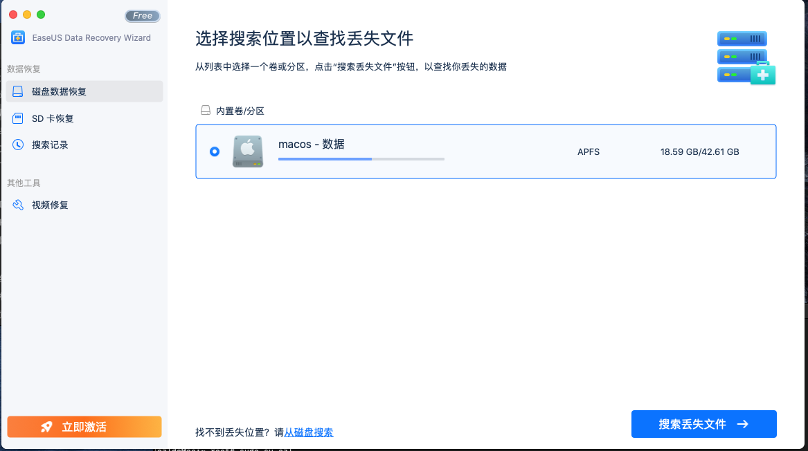

程序主要包含四个功能，磁盘数据恢复、SD卡恢复、导入搜索记录、视频修复

点击立即激活按钮

其中除了恢复到本地有2GB、回复SD卡数据是免费的，其他都不能用，我们使用视频修复功能试试

使用视频修复功能

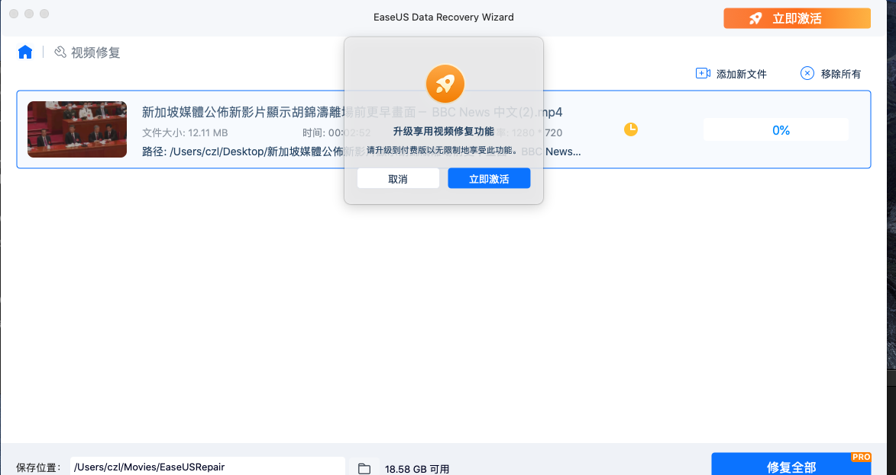

当我点击修复的使用会出现一个模态弹窗

### 观察程序的内部结构

然后观察程序的内部结构

/Applications/EaseUS\ Data\ Recovery\ Wizard.app/Contents 

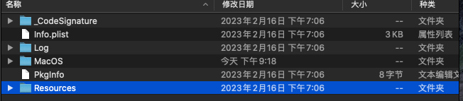

看MacOS文件夹

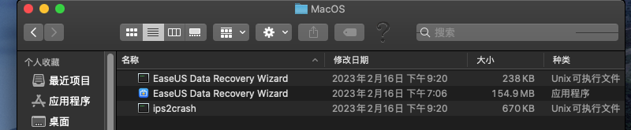

这个文件夹非常有意思，有两个同名的文件，一个是可执行文件，一个是应用程序，我猜测可执行文件是一个启动器，原因是因为可执行文件虽然是入口文件，但是它的大小只有238KB，不太可能是主程序，而应用程序有150多MB，核心功能应该是在这里。ips2crash从名字看 应该是崩溃报告

>注：为什么判断名字为 `EaseUS Data Recovery Wizard`的可执行文件是入口文件，是因为在`Macos` 中 <应用名称>.app的入口文件为和 <应用名称>名字相同的可执行文件

 /Applications/EaseUS\ Data\ Recovery\ Wizard.app/Contents/MacOS/EaseUS\ Data\ Recovery\ Wizard.app/Contents 

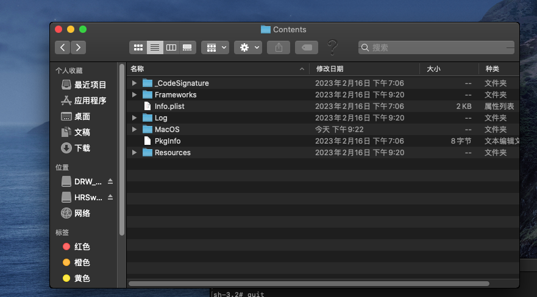

向看看Frameworks

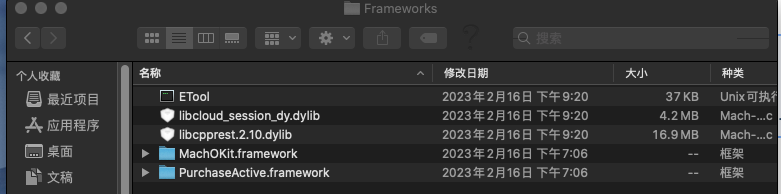

`ETool`看不出什么，`libcloud_session_dy.dylib`应该是恢复到云盘中处理登陆云盘的`session`的库，libcpprest.2.10.dylib和`MachOKit.framework`看不出啥，`PurchaseActive.framework`应该是购买激活的库

再看看MacOS文件夹

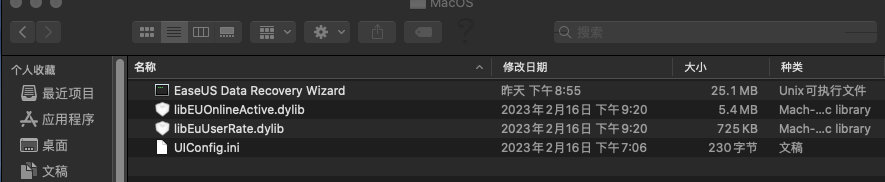

可以看到这里有主程序入口`EaseUS Data Recovery Wizard`，`libEUOnlineActive.dylib`是在线激活的库，`libEuUserRate.dylib`看不出来，`UIConfig.ini`是配置文件

### 程序的破解思路

好的程序的功能和基本的内部结构我们摸清楚了，我们的目的是要破解该软件，那么就必须找到判断是否注册的函数，可是使用视频修复功能，在点击修复后，程序会判断用户是否注册，然后在决定是否弹窗提示注册，或者执行视频修复功能。

有几种思路可以作为入口点，

一、使用字符串搜索弹窗文案，记得把语言切到英文，可以定位到弹窗函数

二、使用字符串 搜索api，搜索 alert 、prompt、dialog、activate、active等，看看有没有感兴趣的api

三、通过万能中断法，因为这个弹窗是模态弹窗，所以可以使用这个办法，先暂停程序，然后看堆栈，找到弹窗函数

四、OSX objective c 原生函数为[CommonMsgWindow runMsg],可以在这个函数打断点，断下后再看堆栈，找到弹窗函数

### 附加主程序

由于这里的弹窗是模态窗口，所以我们用万能中断法比较快一点

首先我们要附加到主程序

打开活动监视器，搜索Ease,获取pid

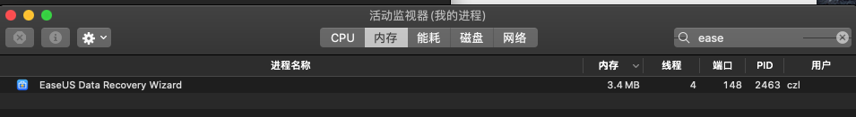

使用lldb 附加该进程

~~~shell
czl@czldeMac ~ % lldb attach -p 2463                                                                                             
(lldb) process attach --pid 2463
Process 2463 stopped
* thread #1, queue = 'com.apple.main-thread', stop reason = signal SIGSTOP
    frame #0: 0x00007fff6d658dfa libsystem_kernel.dylib`mach_msg_trap + 10
libsystem_kernel.dylib`mach_msg_trap:
->  0x7fff6d658dfa <+10>: ret    
    0x7fff6d658dfb <+11>: nop    

libsystem_kernel.dylib`mach_msg_overwrite_trap:
    0x7fff6d658dfc <+0>:  mov    r10, rcx
    0x7fff6d658dff <+3>:  mov    eax, 0x1000020
Target 0: (EaseUS Data Recovery Wizard) stopped.

Executable module set to "/Applications/EaseUS Data Recovery Wizard.app/Contents/MacOS/EaseUS Data Recovery Wizard".
Architecture set to: x86_64h-apple-macosx-.
~~~

使用image list 看看主模块是不是我们想要的

~~~shell
(lldb) image list
[  0] 64F94BA3-1213-35E7-A4E3-5407ADA499BE 0x00000001037fc000 /Applications/EaseUS Data Recovery Wizard.app/Contents/MacOS/EaseUS Data Recovery Wizard 
[  1] 26346F4C-B18E-31A1-9964-30736214F1BF 0x00000001121f8000 /usr/lib/dyld 
[  2] 0CF8726A-BE41-3E07-B895-FBC44B75450E 0x00007fff4102b000 /System/Library/Frameworks/SystemConfiguration.framework/Versions/A/SystemConfiguration 
~~~

很遗憾这个`/Applications/EaseUS Data Recovery Wizard.app/Contents/MacOS/EaseUS Data Recovery Wizard `并不是我们想要的，这个只是启动器而已。我把这个进程强制关闭后，程序并没有退出也验证了这一点，并且我卡住进程的时候界面也没有卡住

可是我只搜到这一个进程，那么主程序的进程去哪了，但前面熟悉程序功能的时候，改软件申请了管理员权限，让我想到了一种可能，那就是程序以管理员的方式启动了。由于活动监视是分用户显示的，而我这里只显示了我自己的进程

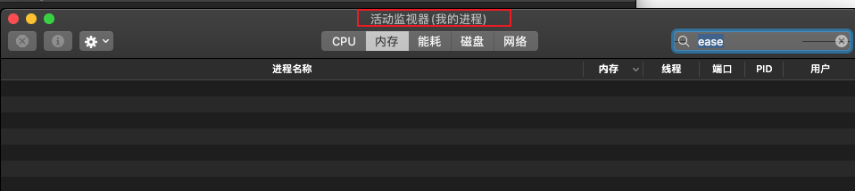

我们修改显示方式，显示所有进程

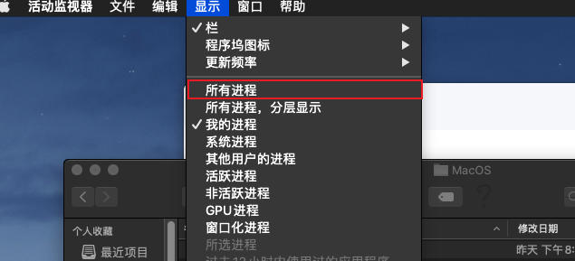

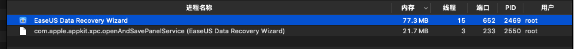

然后就找到了我们需要的进程，用户组是root

同样的我们用lldb附加

~~~
czl@czldeMac ~ % lldb attach -p 2469
(lldb) process attach --pid 2469
error: attach failed: tried to attach to process as user 'czl' and process is running as user 'root'
~~~

但是出现了这样的错误，没关系我们使用`sudo su -`切换到root用户，再试一次

~~~
czldeMac:~ root# lldb attach -p 2469
(lldb) process attach --pid 2469
Process 2469 stopped
* thread #1, queue = 'com.apple.main-thread', stop reason = signal SIGSTOP
    frame #0: 0x00007fff6d658dfa libsystem_kernel.dylib`mach_msg_trap + 10
libsystem_kernel.dylib`mach_msg_trap:
->  0x7fff6d658dfa <+10>: retq   
    0x7fff6d658dfb <+11>: nop    

libsystem_kernel.dylib`mach_msg_overwrite_trap:
    0x7fff6d658dfc <+0>:  movq   %rcx, %r10
    0x7fff6d658dff <+3>:  movl   $0x1000020, %eax          ; imm = 0x1000020 
Target 0: (EaseUS Data Recovery Wizard) stopped.

Executable module set to "/Applications/EaseUS Data Recovery Wizard.app/Contents/MacOS/EaseUS Data Recovery Wizard.app/Contents/MacOS/EaseUS Data Recovery Wizard".
Architecture set to: x86_64h-apple-macosx-.
~~~

现在的界面是这样的，并且已经卡住

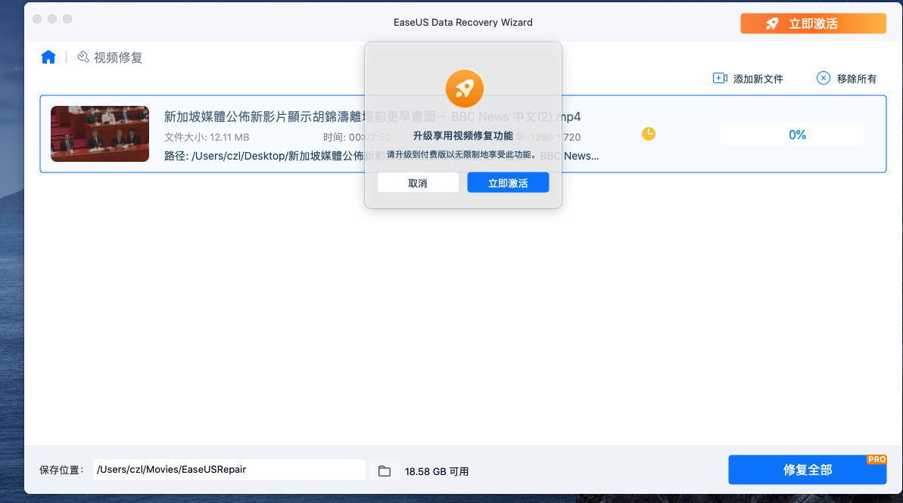

~~~
(lldb) image list
[  0] 28F3FF50-704C-36D3-972B-F2BB9EB8E8D7 0x000000010e804000 /Applications/EaseUS Data Recovery Wizard.app/Contents/MacOS/EaseUS Data Recovery Wizard.app/Contents/MacOS/EaseUS Data Recovery Wizard 
[  1] 26346F4C-B18E-31A1-9964-30736214F1BF 0x0000000117dd7000 /usr/lib/dyld 
[  2] 60465857-3A47-3021-82E8-B0C087C9C68F 0x00007fff3838d000 /System/Library/Frameworks/MediaLibrary.framework/Versions/A/MediaLibrary 
[  3] B4D268D3-D9A4-3434-BDF9-82C715B5F9C8 0x00000001158a8000 /Applications/EaseUS Data Recovery Wizard.app/Contents/MacOS/EaseUS Data Recovery Wizard.app/Contents/Frameworks/libcloud_session_dy.dylib 
~~~

模块确实是我们想要的路径，看来附加的确实是主程序

### 定位关键跳转

查看堆栈

~~~
(lldb) bt
* thread #1, queue = 'com.apple.main-thread', stop reason = signal SIGSTOP
  * frame #0: 0x00007fff6d658dfa libsystem_kernel.dylib`mach_msg_trap + 10
    frame #1: 0x00007fff6d659170 libsystem_kernel.dylib`mach_msg + 60
    frame #2: 0x00007fff336b5f85 CoreFoundation`__CFRunLoopServiceMachPort + 247
    frame #3: 0x00007fff336b4a52 CoreFoundation`__CFRunLoopRun + 1319
    frame #4: 0x00007fff336b3ece CoreFoundation`CFRunLoopRunSpecific + 462
    frame #5: 0x00007fff322e2abd HIToolbox`RunCurrentEventLoopInMode + 292
    frame #6: 0x00007fff322e27d5 HIToolbox`ReceiveNextEventCommon + 584
    frame #7: 0x00007fff322e2579 HIToolbox`_BlockUntilNextEventMatchingListInModeWithFilter + 64
    frame #8: 0x00007fff3092a829 AppKit`_DPSNextEvent + 883
    frame #9: 0x00007fff30929070 AppKit`-[NSApplication(NSEvent) _nextEventMatchingEventMask:untilDate:inMode:dequeue:] + 1352
    frame #10: 0x00007fff30c2b6d2 AppKit`-[NSApplication _doModalLoop:peek:] + 315
    frame #11: 0x00007fff30c2a465 AppKit`__35-[NSApplication runModalForWindow:]_block_invoke_2 + 64
    frame #12: 0x00007fff30c2a412 AppKit`__35-[NSApplication runModalForWindow:]_block_invoke + 70
    frame #13: 0x00007fff30c29ca4 AppKit`_NSTryRunModal + 100
    frame #14: 0x00007fff30c29b89 AppKit`-[NSApplication runModalForWindow:] + 128
    frame #15: 0x000000010e93fd8c EaseUS Data Recovery Wizard`-[ZZAppState ZZStartModalWindow:] + 495
    frame #16: 0x000000010e85861c EaseUS Data Recovery Wizard`-[CommonMsgWindow runMsg] + 69
    frame #17: 0x000000010e8408f5 EaseUS Data Recovery Wizard`-[VideoRepairDetailViewController showActivePrompt] + 362
    frame #18: 0x000000010e83fa91 EaseUS Data Recovery Wizard`-[VideoRepairDetailViewController RepairClicked:withData:] + 457
    frame #19: 0x000000010e8222d1 EaseUS Data Recovery Wizard`-[VideoRepairBarViewController repairBtnClicked:] + 469
    frame #20: 0x00007fff30b6cfc7 AppKit`-[NSApplication(NSResponder) sendAction:to:from:] + 299
    frame #21: 0x00007fff30b6ce62 AppKit`-[NSControl sendAction:to:] + 86
    frame #22: 0x00007fff30b6cd94 AppKit`__26-[NSCell _sendActionFrom:]_block_invoke + 136
    frame #23: 0x00007fff30b6cc96 AppKit`-[NSCell _sendActionFrom:] + 171
    frame #24: 0x00007fff30b6cbdd AppKit`-[NSButtonCell _sendActionFrom:] + 96
    frame #25: 0x00007fff30b68ebb AppKit`NSControlTrackMouse + 1745
    frame #26: 0x00007fff30b687c2 AppKit`-[NSCell trackMouse:inRect:ofView:untilMouseUp:] + 130
    frame #27: 0x00007fff30b68681 AppKit`-[NSButtonCell trackMouse:inRect:ofView:untilMouseUp:] + 691
    frame #28: 0x00007fff30b679fd AppKit`-[NSControl mouseDown:] + 748
    frame #29: 0x000000010e82786c EaseUS Data Recovery Wizard`-[VideoRepairButton mouseDown:] + 117
    frame #30: 0x00007fff30b5f4f9 AppKit`forwardMethod + 204
    frame #31: 0x00007fff30b65e10 AppKit`-[NSWindow(NSEventRouting) _handleMouseDownEvent:isDelayedEvent:] + 4914
    frame #32: 0x00007fff30ad0611 AppKit`-[NSWindow(NSEventRouting) _reallySendEvent:isDelayedEvent:] + 2612
    frame #33: 0x00007fff30acf9b9 AppKit`-[NSWindow(NSEventRouting) sendEvent:] + 349
    frame #34: 0x00007fff30acdd44 AppKit`-[NSApplication(NSEvent) sendEvent:] + 352
    frame #35: 0x000000010e93cc27 EaseUS Data Recovery Wizard`-[MyNSApplication sendEvent:] + 544
    frame #36: 0x00007fff3091adaf AppKit`-[NSApplication run] + 707
    frame #37: 0x00007fff308ecb86 AppKit`NSApplicationMain + 777
    frame #38: 0x000000010e887707 EaseUS Data Recovery Wizard`main + 451
    frame #39: 0x00007fff6d517cc9 libdyld.dylib`start + 1

~~~

从名字上看`[VideoRepairDetailViewController showActivePrompt]`是弹窗函数，那么注册判断函数应该在`[VideoRepairDetailViewController RepairClicked:withData:]`中

我们使用`IDA`定位到`[VideoRepairDetailViewController RepairClicked:withData:]+457`位置处

在api搜索`RepairClicked`，定位到函数首地址

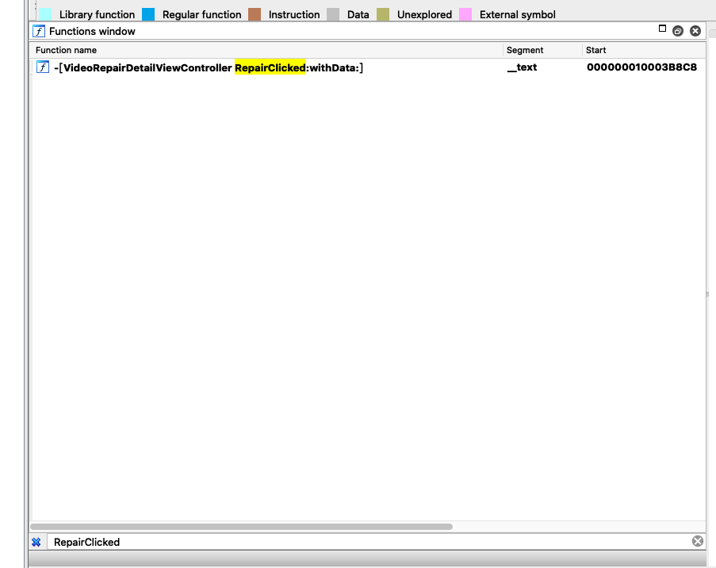

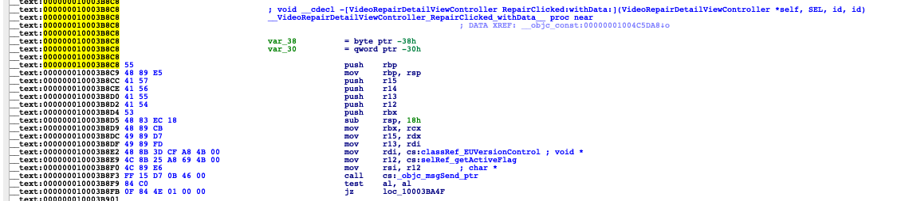

函数首地址为0x000000010003B8C8,由于457是10进制，计算地址的时候要转换为16进制0x1C9

目标地址为 0x000000010003B8C8 + 0x1C9 = 0x10003BA91，我们定位到该地址

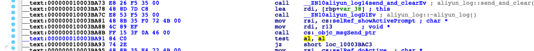

上一句的确是在调用`showActivePrompt`,切换到图表视图

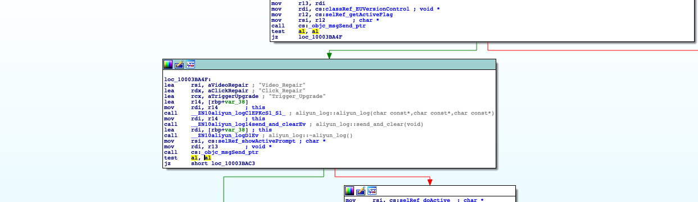

可以看到在`showActivePrompt`的上面有一个关键跳转，并且在跳转前有一个叫`getActiveFlag`的函数，这个函数应该就是注册判断函数，当返回值为0时，调用`showActivePrompt`,提示注册，当返回值为1时，执行正常的功能

### 验证关键跳转

我们可以使用lldb立刻验证

在`test al, al`打断点(0x000000010003B8F9)

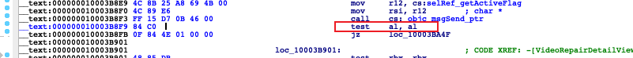

首先按`IDA`里按ctr+G 查看模块基址

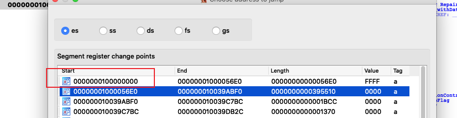

用0x000000010003B8F9 - 模块基址 = RVA = 0x000000000003B8F9

在lldb查看基址随机化后的模块基地址

~~~
(lldb) image list "EaseUS Data Recovery Wizard"
[  0] 28F3FF50-704C-36D3-972B-F2BB9EB8E8D7 0x000000010e804000 /Applications/EaseUS Data Recovery Wizard.app/Contents/MacOS/EaseUS Data Recovery Wizard.app/Contents/MacOS/EaseUS Data Recovery Wizard 
~~~

目标地址为`随机化后的模块基地址` + `Rva` = 0x000000010e804000 + 0x000000000003B8F9 = 0x10E83F8F9

在 0x10E83F8F9 打断点，运行程序

~~~
(lldb) breakpoint set -a 0x10E83F8F9
Breakpoint 1: where = EaseUS Data Recovery Wizard`-[VideoRepairDetailViewController RepairClicked:withData:] + 49, address = 0x000000010e83f8f9
(lldb) c
Process 2469 resuming
~~~

回到程序，重新点击修复，程序触发断点

~~~
Process 2469 stopped
* thread #1, queue = 'com.apple.main-thread', stop reason = breakpoint 1.1
    frame #0: 0x000000010e83f8f9 EaseUS Data Recovery Wizard`-[VideoRepairDetailViewController RepairClicked:withData:] + 49
EaseUS Data Recovery Wizard`-[VideoRepairDetailViewController RepairClicked:withData:]:
->  0x10e83f8f9 <+49>: test   al, al
    0x10e83f8fb <+51>: je     0x10e83fa4f               ; <+391>
    0x10e83f901 <+57>: test   rbx, rbx
    0x10e83f904 <+60>: je     0x10e83fad8               ; <+528>
Target 0: (EaseUS Data Recovery Wizard) stopped.
~~~

查看寄存器rax,修改rax的值为1

~~~
(lldb) register read rax
     rax = 0x0000000000000000
(lldb) register write rax 1
(lldb) register read rax
     rax = 0x0000000000000001
~~~

运行后，这个断点又被触发了一次，再按上面修改即可

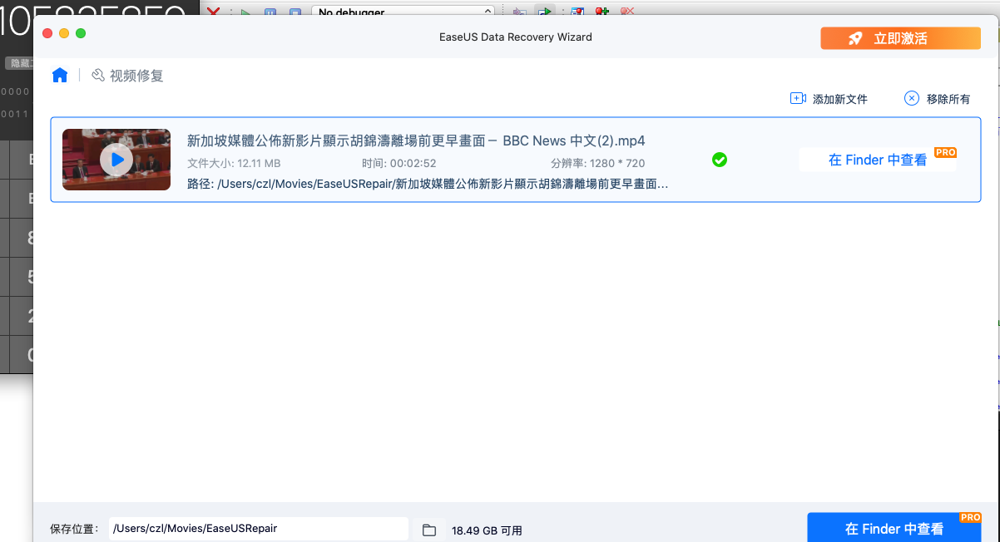

修复成功了，看来这里就是关键点了

### 修改注册判断函数

我们转到`IDA`,`getActiveFlag`函数

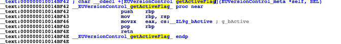

这个函数非常简单，就是返回一个静态变量的值而已，我们把返回值改为1就行

设置显示机器指令

打开Options->General

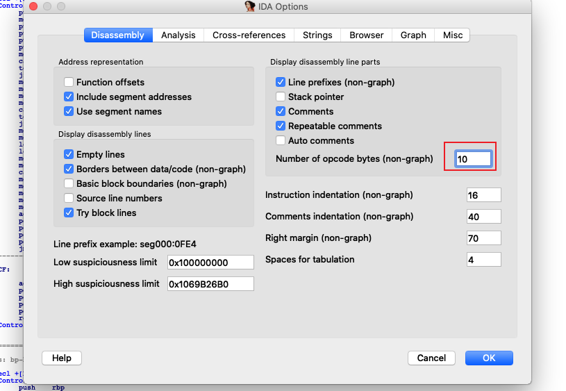

修改 `Number of opcode bytes(non-graph)`为10

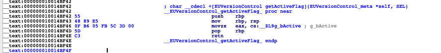

可以看到`movzx   eax, cs:__ZL9g_bActive`的机器指令非常长，所以我们直接改成`mov eax,1`就行了，如果位置不够话还可以改成`xor eax,eax` ,`inc eax`也行。

点击IDA  选项卡 Edit -> Patch program -> assembley,修改汇编指令为`mov eax,1`,多出来的字节改成`nop`

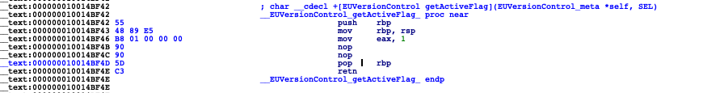

点击Edit -> Patch program ->Apply patchs to input file,并点击备份

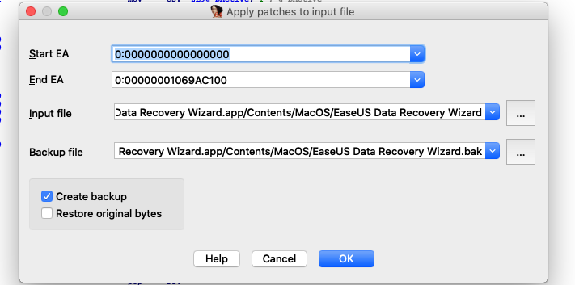

### 破解成功

重新启动程序，即可破解完成

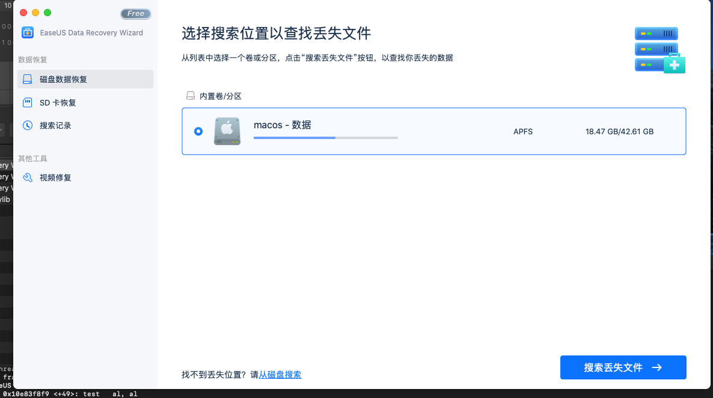