# 破解UnlockGo (Android)

首先观察程序的安装目录

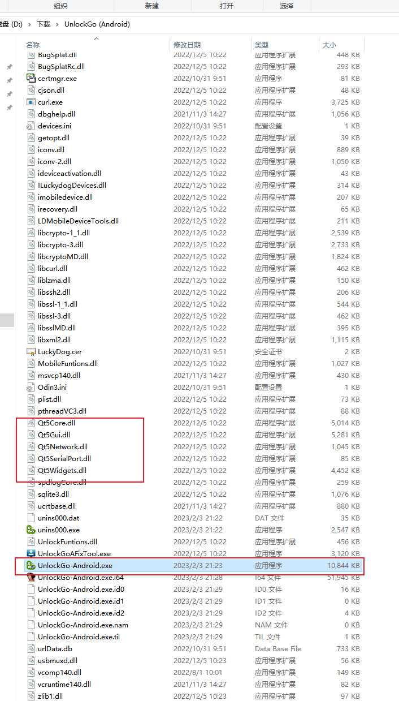

由上可知，这个是qt写的程序，主程序为UnlockGo-Android.exe,然后用PE文件工具去除随机基址，方便后面分析

使用X64dbg打开UnlockGo-Android.exe，按F9直接运行

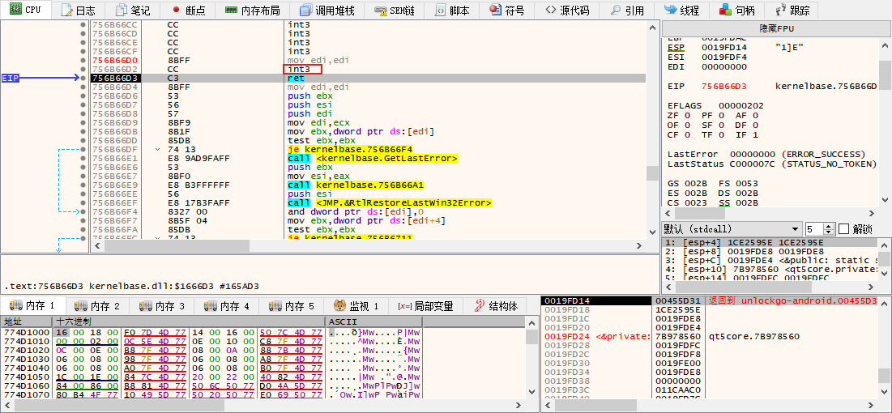

发现直接断在了cc这里，看来启动处有反调试

我们可以试试直接打开程序，然后使用附加功能，附加主程序

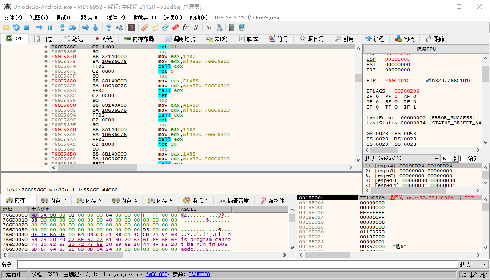

附加成功了，看来运行过程中并没有反调试

观察程序，发现在点击移除屏幕锁的会弹出注册对话框

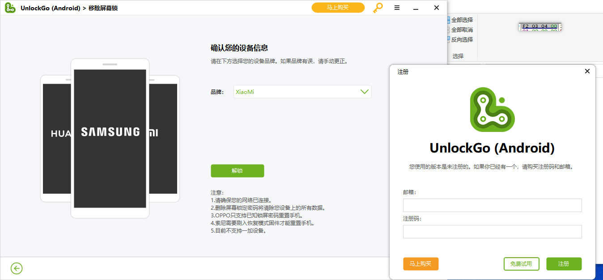

那在点击解锁之后，必定会去判断用户是否注册，然后再决定是否弹对话框

由于这个对话框是模态对话框，所以接下来我们使用万能中断法定位当前执行位置，就是直接暂停，看堆栈

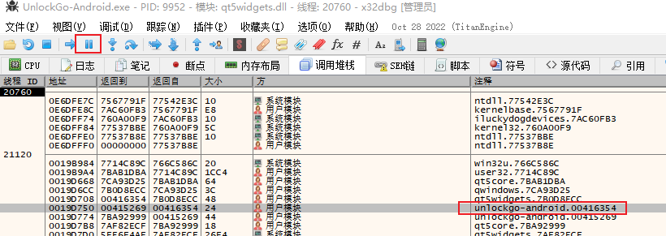

定位到00416354

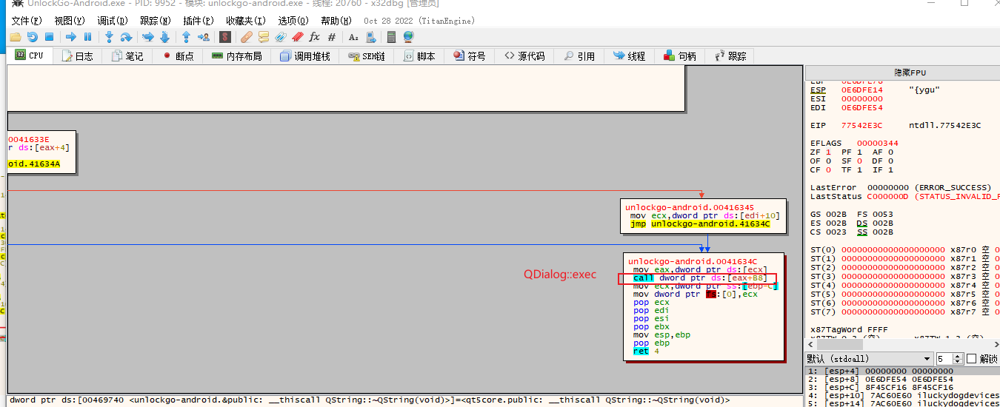

可以看到上面的函数调用了QDialog::exec，说明我们找对了，但是调用exec在函数的最后面，说明无论如何都会调用这个exec，这个函数并没有关键的条件跳转

我们继续向上回溯

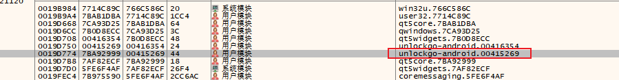

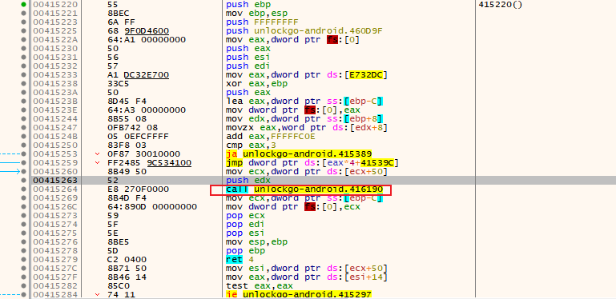

这里明显是一个Switch结构，若第一个参数的第三个成员==0x03F2，则调用0x416190()

继续向上回溯发现是Qt模块了，所以我不停的向上回溯，希望找到主模块，但是最后线程直接结束了，说明这个函数是异步调用的

我猜测这个是个槽函数，所以分析this对象，找到静态元对象

在415220处打断点，断住后，在内存窗口打开ecx

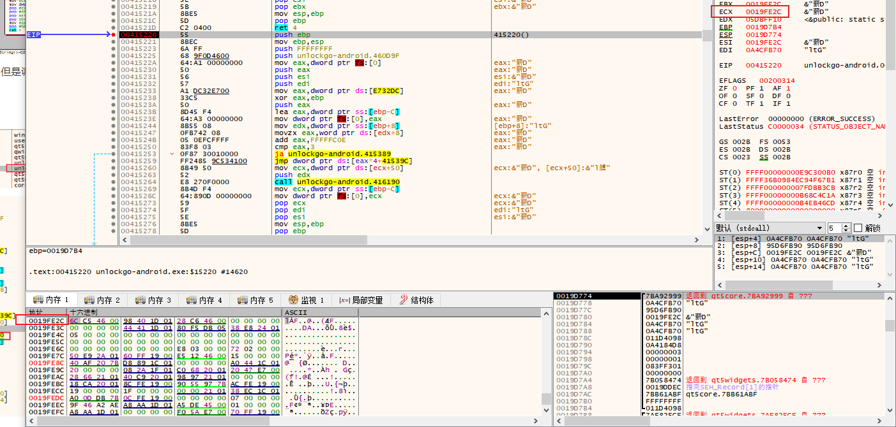

this对象第一个成员是虚表的地址，在内存窗口打开虚表，QObject虚表的第一个成员是QObject::metaObject()，这个函数的功能是返回[staticMetaObject]的

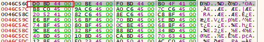

在反汇编窗口打开这个函数

这个返回了一个静态地址，这个地址就是静态元对象的地址

在内存窗口中打开这个地址

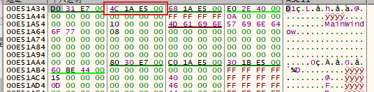

第一个成员是基类静态元对象的地址，第二成员包含了函数的信号槽的签名信息

在内存窗口打开第二个成员的地址

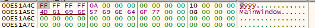

发现只有一个类型信息，这个类的名字叫MainWindow，但是没有任何的信号槽

我们在内存窗口打开基类的基类静态元对象的第二个成员

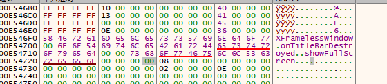

Google后发现XFramelessWindow已经是Qt自带的类了，说明关键函数不是由信号槽传递的，到这里我的思路已经断了

后面在上几层堆栈中看到了函数QObject::event

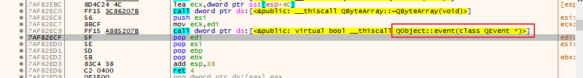

我就猜测00415220()是不是一个重写父类函数的方法

在反汇编中打开上一层堆栈的函数调用，看看上一层函数是如何调用00415220()

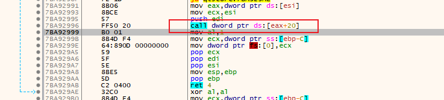

00415220()这个函数是虚表的第9个函数

在Ida中打开mainWindow的虚表

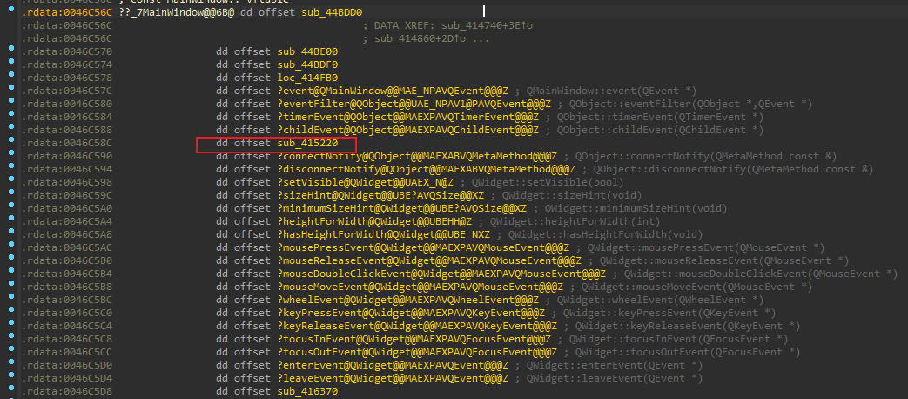再打开XFramelessWindow的虚表

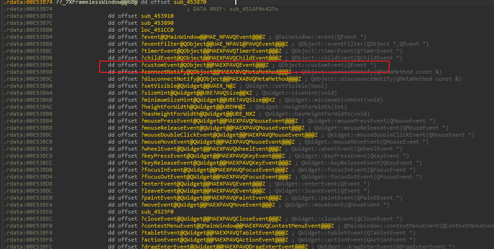

XFramelessWindow的虚表第9个成员为QObject::customEvent(QEvent *)，说明MainWindow重写的就是QObject::customEvent(QEvent *)方法，将00415220()改为customEvent，再Google搜索后发现这个函数是用来接收处理自定义事件的，这个事件是由`bool QCoreApplication::sendEvent(QObject *receiver, QEvent *event)`或`void QCoreApplication::postEvent(QObject *receiver, QEvent *event, int priority = Qt::NormalEventPriority)`发送的，只不过一个是同步的，一个是异步的，本案例的情况应该是postEvent。

在postEvent处打条件断点，暂停条件为`([arg.get(1)+8]&0x0000FFFF) == 0x000003F2`

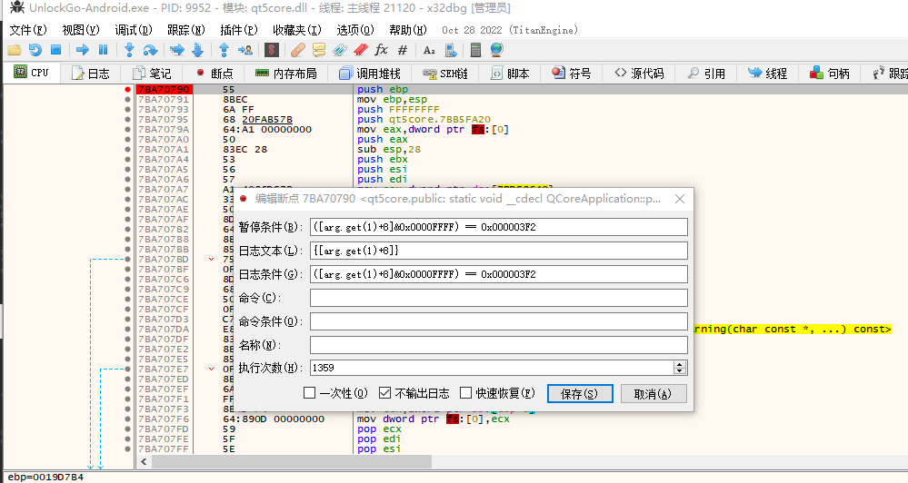

断住后进行堆栈回溯

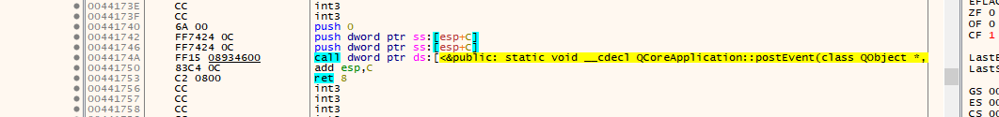

这一层明显没有关键跳转，继续回溯

提示x64dbg,按g进入图表视图

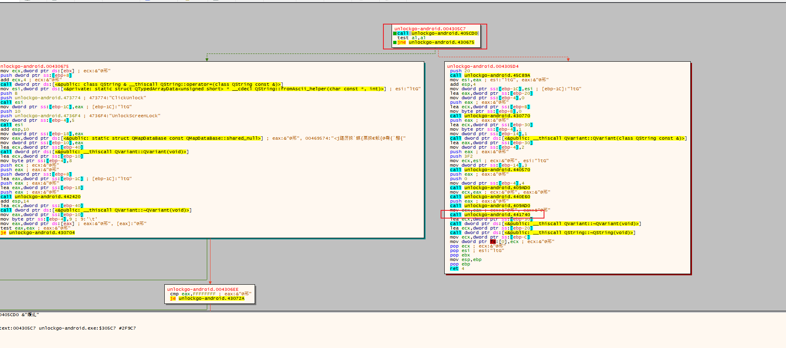

明显这个有关键跳转，当405CD0函数返回值为true，则正常执行功能，反之则弹出注册框，说明405CD0为判断注册函数，将它改为isRegistered

打开isRegistered

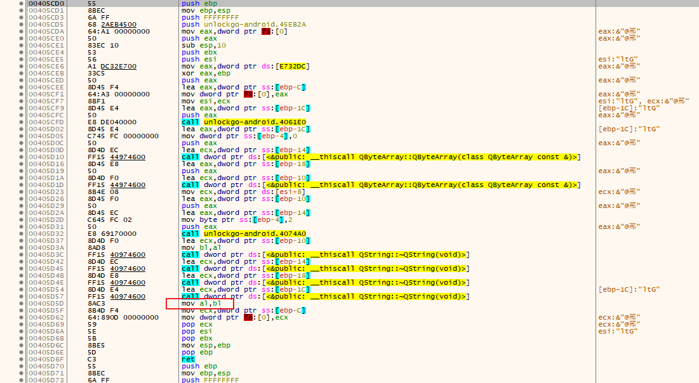

修改最后的返回值为1，并且打补丁替换，即可破解成功

替换后发现

看来是有线程在检查注册码有否有效，然后弹出对话框，最后退出程序

这个比较简单，思路是先万能中断到关键函数，然后找到退出程序的函数，nop掉它就可以了，就不详细说明了

总的来说，这次破解用到了万能中断法、c++虚函数与继承机制、Qt元对象机制、Qt事件机制等技巧与知识，这个程序有一点反调试、采用了异步调用来避免破解，难度中等。