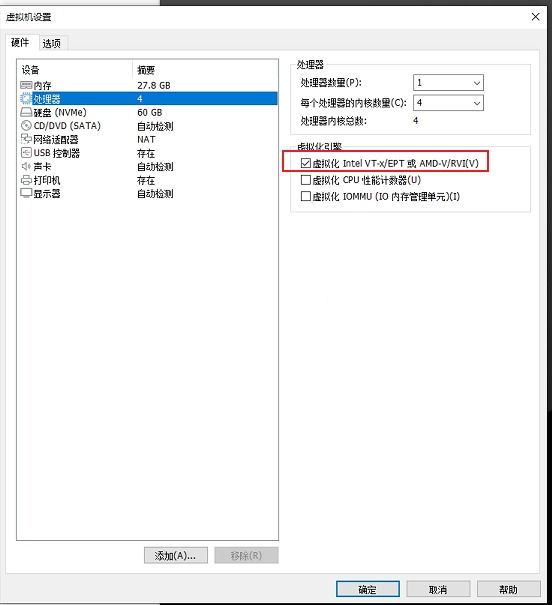

## 配置vt调试器插件HyperHide
### 材料与基础
 - 操作系统  win7 - win10  (x64)
 - 虚拟机	VMware Workstation(推荐)
 - 处理器	支持 VT-x 和 EPT 的英特尔处理器

### 配置虚拟机

一定要开启处理器虚拟化 intel vt-x或者amd-v这两个才能保证hyperhide的两个驱动能够正常运行

### 下载hyperhide插件

下载地址

[Release HyperHide_2023-02-16 · Air14/HyperHide (github.com)](https://github.com/Air14/HyperHide/releases/tag/HyperHide_2023-02-16)

### 进入测试环境

打开虚拟机，使用管理权限打开命令行运行下面的命令打开测试签名模式（本身这两个驱动没有驱动签名，必须测试环境）

~~~bash
bcdedit /set testsigning on
~~~

执行完后重启即可

### 打开驱动程序

将 HyperHideDrv.sys 和 airhv.sys放入 C:\Windows\System32\drivers,然后打开HyperHide/Scripts 文件夹,并使用管理员权限执行 create.bat和on.bat

~~~bash
create.bat
~~~

~~~bash
on.bat
~~~

### 配置x64dbg插件

32 位：将 HyperHide.ini 和 HyperHide.dp32 复制到 \x32\plugins\ 目录。
64 位：将 HyperHide.ini 和 HyperHide.dp64 复制到 \x64\plugins\ 目录。

- 打开x64dbg

就出现了HyperHide

打开插件的option选项，就出现了HyperHide的配置界面，至此配置完毕

> 如果不使用插件，记得执行HyperHide/Scripts 文件夹的off.bat,关闭插件驱动

> 请不要在真机上配置这个插件，蓝屏警告